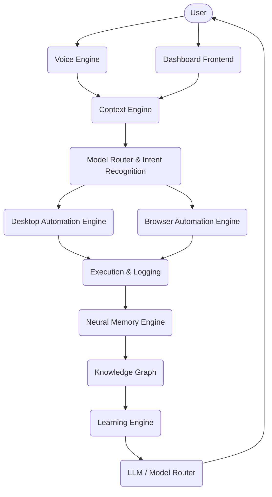
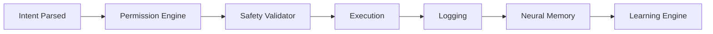
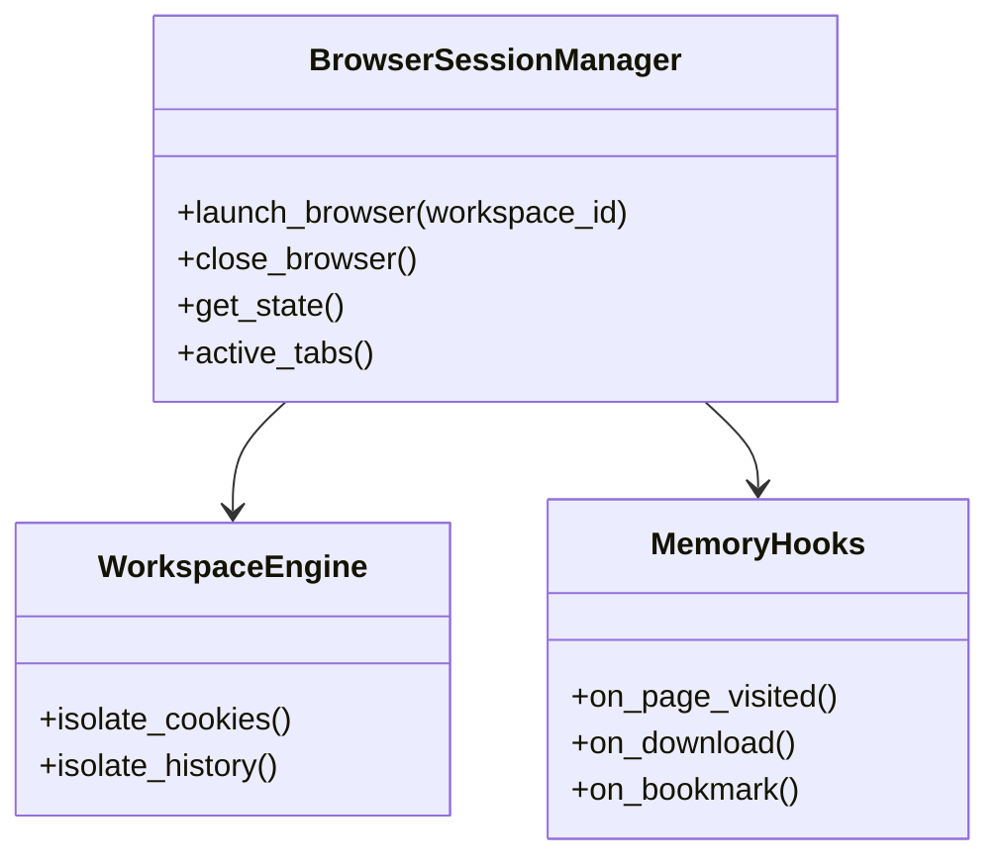

# NOVA_X System Architecture

NOVA_X is an advanced Neural Operating Virtual Assistance platform designed to seamlessly integrate Voice, Desktop, and Browser automation through a robust, security-first 7-step execution pipeline.

## 1. Complete System Architecture

NOVA_X is built with modularity and security at its core.



## 2. Folder Structure

```text
NOVA_X/
├── backend/
│   ├── browser_engine/     # Phase 5: Browser automation, Workspaces, Sessions
│   ├── core/               # App configuration and settings
│   ├── database/           # SQLite/PostgreSQL models and connection
│   ├── desktop_engine/     # Phase 4: Permissions, Safety Validator, Macros
│   ├── memory_engine/      # Phase 3: Neural Memory, Knowledge Graph, Learning
│   ├── routers/            # API endpoints
│   ├── security/           # Authentication and auth utilities
│   └── utils/              # Telemetry, Logger, utilities
├── frontend/               # Phase 2: React Dashboard UI
├── docs/                   # Documentation and audit reports
├── ARCHITECTURE.md         # System Architecture
├── requirements.txt
└── README.md
```

## 3. The 7-Step Execution Pipeline

Every actionable intent routed to NOVA_X (whether Browser or Desktop) MUST traverse this pipeline. Bypassing the Safety Validator is strictly forbidden.



### Module Responsibilities

#### 3.1 Permission Engine
Enforces 4-level security:
- **SAFE**: Automatically allowed (e.g., read public info).
- **MEDIUM**: Uploads, logins.
- **HIGH**: Editing account info, system settings.
- **CRITICAL**: Requires explicit user consent (e.g., payments, account deletion, file execution).

#### 3.2 Safety Validator
Sanitizes the target. For files, checks extensions. For terminals, scans for malicious flags. For browsers, validates URL protocols to prevent local file scraping (`file://`).

#### 3.3 Neural Memory Engine & Knowledge Graph
Every action is embedded into ChromaDB (Semantic Memory) and tracked relationally in the Knowledge Graph. It features a Memory Decay algorithm to forget stale data.

#### 3.4 Learning Engine
Observes the user's habits (e.g., most visited documentation) via local telemetry and reinforces the Knowledge Graph to preemptively optimize workflows.

## 4. Browser Engine Architecture

The Browser Engine operates heavily on **Workspaces** to isolate sessions, history, and cookies (Personal, Work, Research, College, Development).



## 5. Security Model

NOVA_X treats Desktop and Browser spaces as untrusted by default.
1. **API Layer**: Secured via JWT tokens.
2. **Action Validation**: Mapped to strict `ActionType` Enums.
3. **Telemetry**: Stored 100% locally (`telemetry.jsonl`). Never transmitted externally.
4. **Data Isolation**: Workspaces completely silo browsing data to prevent cross-contamination between contexts (e.g., Work vs Personal).

## 6. Runtime Lifecycle

The platform utilizes FastAPI's event loops integrated with `APScheduler` (running `AsyncIOScheduler` with `MemoryJobStore` for dev) to continuously execute:
- Memory Decay (`run_memory_decay`)
- Learning Reinforcement (`run_learning_reinforcement`)
- Desktop Scheduled Tasks (`run_desktop_scheduler`)
