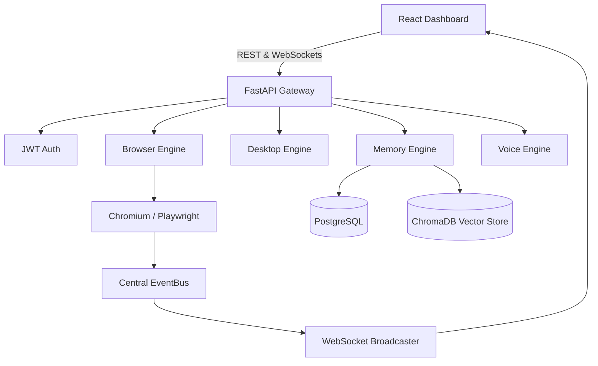

# NOVA_X System Architecture

## High-Level Topology

## Backend Architecture
NOVA_X uses FastAPI for routing, organized into modular engine directories:
- `backend/browser_engine`: The `BrowserSessionManager` acts as the orchestrator for headless interactions via `PlaywrightDriver`.
- `backend/desktop_engine`: Exposes OS-level abstractions (mouse, keyboard, terminal) monitored by a `SafetyValidator`.
- `backend/memory_engine`: Embeds unstructured text into ChromaDB and maps Knowledge Graphs into PostgreSQL.
- `backend/routers`: Contains isolated REST API layers matching the engines.

## Frontend Architecture
The React Dashboard (powered by Vite and TailwindCSS) is a composition of decoupled widgets. 
- The `BrowserDashboard.tsx` root orchestrates layout using CSS Grid.
- State is primarily handled via a central `BrowserWebSocketProvider` delivering low-latency EventBus updates directly into widget states.

## Event-Driven Architecture
All backend operations are decoupled via a Singleton `EventBus`.
When `BrowserSessionManager` opens a tab, it emits a `TAB_OPENED` event. The `ConnectionManager` running on `/ws/browser` automatically intercepts this bus event, serializes it, and broadcasts it to authenticated WebSocket clients, achieving full reactive telemetry without database polling.

## Deployment Topology
NOVA_X relies on Docker Compose using profiles (`core`, `ai`, `full`). 
The `backend` and `frontend` execute in isolated containers linked by a Docker Bridge Network to `postgres` and optionally `ollama`.
