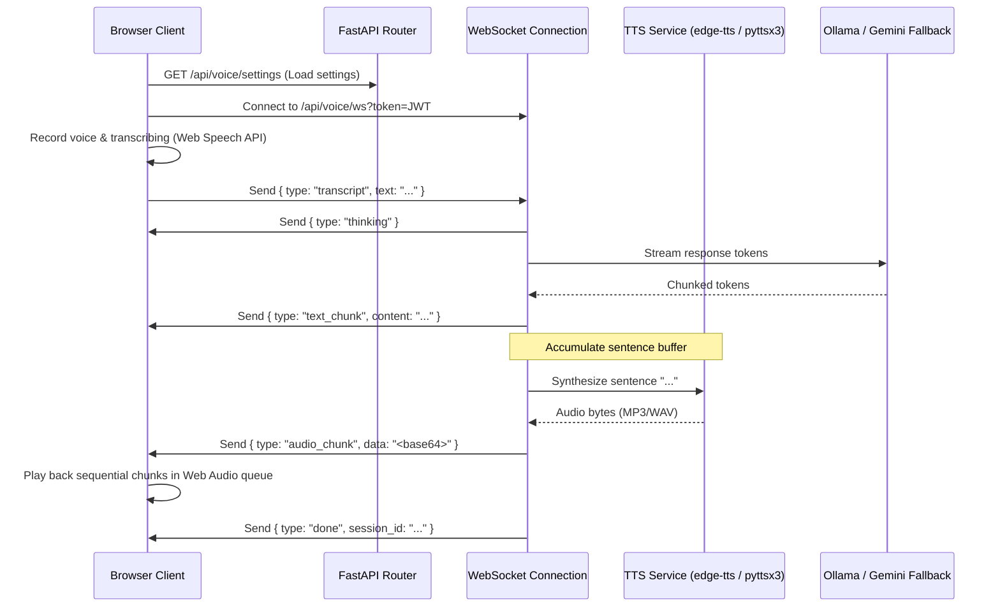

# NOVA_X Voice API Specification

This document details the REST endpoints, WebSocket events, and architecture powering the Phase 2 Voice Module in **NOVA_X**.

---

## 🎙 System Overview

The voice assistant interface communicates using a hybrid REST + WebSocket architecture:
1. **REST APIs**: Used for static actions like retrieving available voices, updating voice preferences, fetching historical sessions, and clearing history.
2. **WebSocket Connection**: Handles bidirectional real-time conversation. The browser streams transcripts (via the Web Speech Recognition API), and the backend streams back raw MP3 text-to-speech audio segments (synthesized sentence-by-sentence via `edge-tts` or offline `pyttsx3`).



---

## 🔒 Authentication

WebSockets cannot pass standard HTTP authorization headers natively in all browsers. Authentication is performed by supplying the standard JWT token as a query parameter:

```
wss://<host>/api/voice/ws?token=<jwt_access_token>
```

If the token is invalid or expired, the backend closes the connection with code `4001`.

---

## 📡 REST API Documentation

### 1. Get Available Voices
* **Endpoint**: `/api/voice/voices`
* **Method**: `GET`
* **Headers**: `Authorization: Bearer <token>`
* **Response**:
```json
{
  "voices": [
    {"id": "en-US-AriaNeural", "name": "Aria (US Female)", "lang": "en-US"},
    {"id": "en-US-GuyNeural", "name": "Guy (US Male)", "lang": "en-US"},
    {"id": "en-IN-NeerjaNeural", "name": "Neerja (IN Female)", "lang": "en-IN"}
  ]
}
```

### 2. Get Voice Settings
* **Endpoint**: `/api/voice/settings`
* **Method**: `GET`
* **Headers**: `Authorization: Bearer <token>`
* **Response**:
```json
{
  "voice_name": "en-US-AriaNeural",
  "language": "en-US",
  "speed": 1.0,
  "pitch": 1.0,
  "volume": 1.0,
  "continuous_mode": false,
  "noise_reduction": true,
  "auto_detect_silence": true
}
```

### 3. Update Voice Settings
* **Endpoint**: `/api/voice/settings`
* **Method**: `POST`
* **Headers**: `Authorization: Bearer <token>`, `Content-Type: application/json`
* **Body**: Same as the response format of `GET /settings`.
* **Response**: Updated settings object.

### 4. Fetch Voice Session History
* **Endpoint**: `/api/voice/history`
* **Method**: `GET`
* **Headers**: `Authorization: Bearer <token>`
* **Response**: List of completed voice turns.
```json
[
  {
    "id": "c1f72fae-9d26-4d10-8208-8e6d3027b4e3",
    "user_transcript": "Hello, how are you?",
    "ai_response": "I am operating optimally. How can I help you today?",
    "language": "en-US",
    "confidence": 98.0,
    "duration_ms": 1250,
    "model_used": "gemma",
    "created_at": "2026-07-24T00:50:00Z"
  }
]
```

### 5. Clear Voice History
* **Endpoint**: `/api/voice/history`
* **Method**: `DELETE`
* **Headers**: `Authorization: Bearer <token>`
* **Response**: `{"message": "Voice history cleared"}`

---

## ⚡ WebSocket Communication Protocol

### Client to Server Messages

#### 1. Send Audio Transcript
Send the final transcribed text captured from speech recognition to trigger an AI response:
```json
{
  "type": "transcript",
  "text": "Tell me a joke",
  "model": "gemma",
  "confidence": 0.95,
  "language": "en-US"
}
```

#### 2. Ping Heartbeat
Must be sent every 20 seconds to prevent reverse proxy/load balancer timeouts:
```json
{
  "type": "ping"
}
```

---

### Server to Client Messages

#### 1. Thinking State
Fired as soon as a transcript is received and the AI is thinking:
```json
{
  "type": "thinking"
}
```

#### 2. Streaming Text Chunk
Fires as the AI returns streaming text tokens:
```json
{
  "type": "text_chunk",
  "content": "Why don't "
}
```

#### 3. Streaming Audio Segment
Fires as a completed sentence is synthesized to speech:
```json
{
  "type": "audio_chunk",
  "data": "<base64 encoded MP3 or WAV audio stream>",
  "mime": "audio/mpeg"
}
```

#### 4. Transaction Complete
Fires after all text and audio segments have been fully dispatched:
```json
{
  "type": "done",
  "session_id": "c1f72fae-9d26-4d10-8208-8e6d3027b4e3"
}
```

#### 5. Pong Heartbeat Reply
Returned instantly on receiving a `ping`:
```json
{
  "type": "pong"
}
```

#### 6. Error Notice
```json
{
  "type": "error",
  "message": "AI service unavailable. Ensure Ollama is running."
}
```

---

## 🚨 Error Codes & Status Codes

* **`4001`**: Unauthorized token. WS connection is immediately closed.
* **`1001`**: Fired when client disconnects or a newer duplicate session is established by the same user.
* **Fallback Behavior**: If edge-tts synthesis fails (e.g. offline Azure access), it automatically routes synthesis to `pyttsx3` locally. If both fail, it dispatches a `"tts_fallback"` signal, prompting the client's browser Web Speech Synthesis API to synthesize speech locally.
